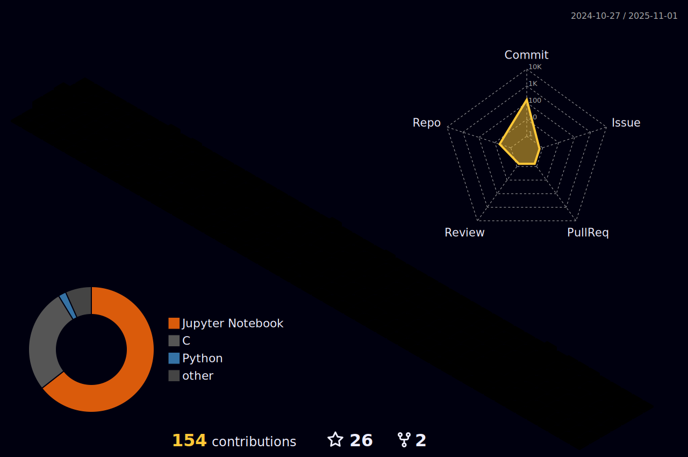

<h2 align='center'>Gabriel S. Ferrante, Computer Vision Researcher and A.I Developer.

</h2>  
  

  
## Academic education
  * I'm graduated of Technology in Systems Analysis and Development at the Federal Institute of Education, Science and Technology of São Paulo - Brazil. 
     Site official (<a href=https://ctd.ifsp.edu.br> IFSP-Catanduva </a>)
  * Master Degree in Computer Science and Computational mathematics at the University of São Paulo - Brazil. 
     Site official (<a href=https://www.icmc.usp.br> ICMC-USP </a>)
  * PhD Student in Computer Science at the Federal University of São Carlos - Brazil.
     Site official (<a href=https://www.ufscar.br> UFSCAR </a>)

ResearchGate - https://www.researchgate.net/profile/Gabriel-Ferrante-8  
ORCID - https://orcid.org/0000-0002-3877-2925  
Lattes - http://lattes.cnpq.br/2972111461924346

  
## Contacts and social medias
   
   
   
   

## Skills in Machine Learning and Deep Learning

  
## Statistics 

  

  <table style="border:none">
  <tr>
      <td> </td>
      <td></td>
  </tr>  
  </table>

     
  

